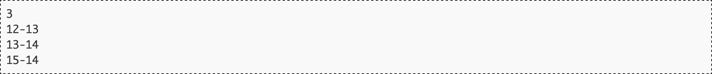

# La 13-14

"Hacer la 13−14" es una expresión coloquial habitual para indicar que una persona ha hecho a otra una trastada. Su origen está en una novatada que se hacía en los talleres mecánicos a los aprendices, a los que se mandaba a por la "llave 13−14", es decir la que tuviera en un extremo un calibre de 13 milímetros, y en otro uno de 14.

Sabiendo que es una novatada, es fácil intuir que esa llave no existe; sí lo hacen la llave 12−13 y la llave 14−15, pero no la muy buscada 13−14, por lo que los aprendices terminaban desesperados buscando una llave que no existía para no parecer torpes sus primeros días.

En este problema haremos la simplificación de asumir que las llaves que existen tienen en cada extremo calibres consecutivos, siendo el menor de ellos par [^info]. Según esto, ¿eres capaz de evitar las bromas de aprendiz?

## Entrada

El primer número de la entrada contendrá cuántos casos de prueba deberán procesarse.

A continuación vendrán dichos casos de prueba, cada uno con la descripción de una llave del taller, con los calibres de cada extremo separados por un guión (a-b). Los calibres serán siempre mayores que 0 y menores que 1.000.000.

## Salida

Por cada caso de prueba el programa escribirá "SI" si la llave existe, y "NO" si no.

## Entrada de ejemplo

## Salida de ejemplo

## Lenguaje empleado

	

---

[🛜 Aquí puedes encontrar el sitio web oficial donde se encuentra este reto.](https://aceptaelreto.com/pub/problems/v003/70/st/statements/Spanish/index.html)

[^info]: Es una simplificación porque a partir de un punto, los calibres reales ni siquiera son consecutivos.